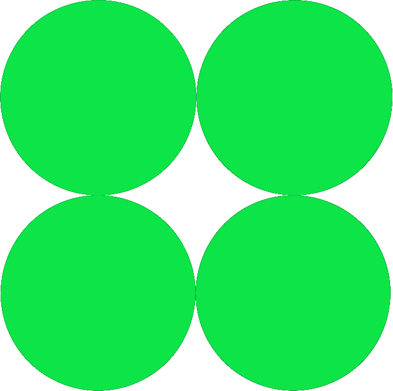

<!------------------------------------------------------------------ Visitors Amount Section ---------------------------------------------------------------------------->
<!-- Visitor Container --> 

  <!-- Visitor Counter --> 
  

<!----------------------------------------------------------------- Greeting Title With Animation -----------------------------------------------------------------------> 
<h1 align="center">
    
</h1>

<!------------------------------------------------------------------ About Me Section -----------------------------------------------------------------------------------> 
<!-- About Me Title --> 
<h2 align="center">🙎‍♂️About Me🙎‍♂️</h2>
<h3 align="center">Hello There 👋! I'm A Computer Science Student At The University Of Central Florida</h3>

    <!-- Makaing Space With Break Lines --> 
  
  I am passionate about coding, web development & design, open-source, and innovation. Always learning and exploring new technologies. Currently started learning of Machine Learning & AI, with a keen interest in applying these technologies to solve real-world problems. I thrive in collaborative environments and enjoy contributing
  
    <!-- Makaing Space With Break Lines --> 
      
   🔭 I’m currently working with **U.S. Space Force** on **ORBIT: AI-Powered IT Automation & Security Solutions** 
   
   🌱 I’m currently learning **LLMs, Generative AI, and RAG pipelines using Hugging Face, as well as Angular, Mapbox, and Three.js.**
  
  💬 Ask me about **My Passion For Innovation And My Future Plans**
  
  ⚡ Fun fact **Capybaras are the largest rodents in the world, but they’re incredibly social and friendly!**

 

<!------------------------------------------------------------------ Statistics Section ---------------------------------------------------------------------------------> 
<!-- Statistics Title --> 
<h2 align="center">⭐Statistics⭐</h2>

  <!-- Makaing Space With Break Lines --> 

<!-- Statistics Container --> 

  <!-- GitHub Graph --> 
  
  
  <!-- Coding Languages Graph --> 
  
  
    <!-- Makaing Space With Break Lines --> 

  <!-- Streak Graph --> 
  

  <!-- Makaing Space With Break Lines --> 

<!------------------------------------------------------------------ Portfolio Website -----------------------------------------------------------------------------------> 
<h2 align="center">🌐Portfolio Website🌐</h2>

  <!-- Makaing Space With Break Lines --> 

<h4 align="center" style="color: white">Check My Portfolio Website Here!</h2>

  
  
  
  <a href="https://www.alexdreyesz.com/" target="_blank" style="text-decoration: none; color: inherit;">
    www.alexdreyesz.com
  </a>

  
    

     <!-- Makaing Space With Break Lines --> 

<!------------------------------------------------------------------ Showcase Section -----------------------------------------------------------------------------------> 
<!-- Showcase Title --> 
<h2 align="center">🖥️Skills🖥️</h2>

<!-- Coding Languages Container --> <!---------------------------------------------------------------------------------------------------------------------------------------------->
<h4>Programming Languages:</h4>

  <!-- C Logo -->
  
  

  <!-- C++ Logo -->
  
  

   <!-- C# Logo -->
  
  

  <!-- JavaScript Logo -->
  
  

  <!-- TypeScript Logo -->
  
  

  <!-- Java Logo -->
  
  

  <!-- Python Logo -->
  
  

   <!-- PHP Logo -->
  
  

<!-- Complementary Languages Container --> <!---------------------------------------------------------------------------------------------------------------------------------------------->
<h4>Complementary Languages:</h4>

   <!-- HTML Logo -->
  
  

  <!-- CSS Logo -->
  
  

   <!-- MYSQL Logo -->
  
  

  <!-- JSON Logo -->
  
  

<!-- Frameworks Container --> <!---------------------------------------------------------------------------------------------------------------------------------------------->
<h4>Frameworks:</h4>

  <!-- React Logo -->
  
  

  <!-- Angular Logo -->
  
  

  <!-- Tailwind CSS Logo -->
  
  

   <!-- Three.js Logo -->
  
  

  <!-- Express Logo -->
  
  

<!-- Libraries Container --> <!---------------------------------------------------------------------------------------------------------------------------------------------->
<h4>Libraries:</h4>

  <!-- Bootstrap Logo -->
  
  
  
  <!-- React Bootstrap Logo -->
  
  
  
  <!-- React Navigation Logo -->
  
  
  
  <!-- React Router Logo -->
  
  

   <!-- GSAP Router Logo -->
  
  
  
  <!-- Anaconda Logo -->
  
  
  
  <!-- MATLAB Logo -->
  
  
  
  <!-- Matplotlib Logo -->
  
  
  
  <!-- Pandas Logo -->
  
  
  
  <!-- NumPy Logo -->
  
  
  
  <!-- PyTorch Logo -->
  
  
  
  <!-- NPM Logo -->
  
  

<!-- Development Tools Container --> <!---------------------------------------------------------------------------------------------------------------------------------------------->
<h4>Development Tools:</h4>
  

    <!-- VSCode Logo -->
  
  
  
  <!-- Eclipse Logo -->
  
  
  
  <!-- Git Logo -->
  
  
  
  <!-- GitHub Logo -->
  
  
  
  <!-- Jupyter Logo -->
  
  
  
  <!-- Linux Logo -->
  
  
  
  <!-- Node.js Logo -->
  
  
  
  <!-- Nodemon Logo -->
  
  
  
  <!-- Postman Logo -->
  
  
  
  <!-- Ubuntu Logo -->
  
  
  
  <!-- Unity Logo -->
  
  
  
  <!-- Unreal Engine Logo -->
  
  
  
  <!-- Vite Logo -->
  
  

<!-- Design Tools Container --> <!---------------------------------------------------------------------------------------------------------------------------------------------->
<h4>Design Tools:</h4>

   <!-- Figma Logo -->
  
  
  
  <!-- Blender Logo -->
  
  
  
  <!-- Canva Logo -->
  
  
  
  <!-- LaTeX Logo -->
  
  
  
  <!-- Photoshop Logo -->
  
  

<!-- Databases Container --> <!---------------------------------------------------------------------------------------------------------------------------------------------->
<h4>Databases:</h4>

    <!-- MariaDB Logo -->
  
  
  
  <!-- Apache Logo -->
  
  
  
  <!-- Azure Logo -->
  
  
  
  <!-- Azure SQL Logo -->
  
  
  
  <!-- MongoDB Logo -->
  
  

<!-- AI & LLMs Container --> <!---------------------------------------------------------------------------------------------------------------------------------------------->
<h4>AI & LLMS:</h4>

   <!-- Chatgpt Logo -->
  
  

   <!-- Claude Logo -->
  
  

   <!-- Copilot Logo -->
  
  

   <!-- Deepseek Logo -->
  
  

   <!-- Gemini Logo -->
  
  

   <!-- Huggingface Logo -->
  
  

<!-- APIs Container --> <!---------------------------------------------------------------------------------------------------------------------------------------------->
<h4>APIs:</h4>

   <!-- OpenAi Logo -->
  
  
  
   <!-- Leaflet Logo -->
  
  

   <!-- Mapbox Logo -->
  
  
  

<!-- Professional Container --> <!---------------------------------------------------------------------------------------------------------------------------------------------->
<h4>Professional:</h4>

   <!-- Slack Logo -->
  
  
  
  <!-- Jira Logo -->
  
  
  
  <!-- Notion Logo -->
  
  
  
  <!-- Stack Overflow Logo -->
  
  

   <!-- LinkedIn Logo -->
  
  

    <!-- Makaing Space With Break Lines --> 

<!-- GIF -->

  
  &nbsp;&nbsp;&nbsp; &nbsp;&nbsp;&nbsp; &nbsp;&nbsp;&nbsp; &nbsp;&nbsp;&nbsp; &nbsp;&nbsp;&nbsp; &nbsp;&nbsp;&nbsp; &nbsp;&nbsp;&nbsp;
  

  <!-- Makaing Space With Break Lines --> 

<!------------------------------------------------------------------ Contributions Section ----------------------------------------------------------------------------->
<!-- Showcase Title --> 
<h2 align="center">📞Contact & Social📞</h2>

  <!-- Makaing Space With Break Lines --> 

<!-- Social Media Container --> 

  

  <!-- Portfolio Website --> 
  
  
  
  <!-- Linkedin Logo --> 
  
  

  <!-- Discord Logo --> 
  
  

  <!-- instagram Logo --> 
  
  

  <!-- Twitter Logo -->
  
  

  <!-- WhatsApp Logo -->
  
  

  <!-- Gmail Logo -->
  
  

  <!-- Makaing Space With Break Lines --> 

<!------------------------------------------------------------------ Contributions Section ----------------------------------------------------------------------------->
<!-- Contributions Title --> 
<h2 align="center">⚡Contributions⚡</h2>

<!-- Snake Graph -->

  

  <!-- Makaing Space With Break Lines --> 

<!-- Graph Chart --> 

  

    <!-- Makaing Space With Break Lines --> 
